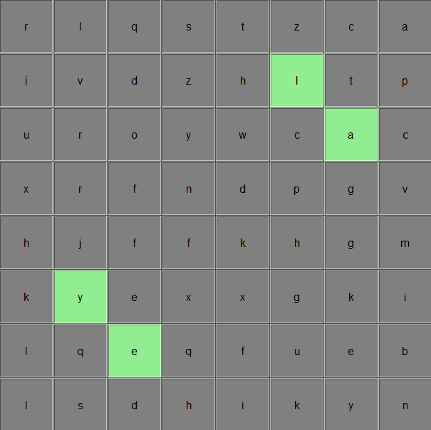

# Path2Palindrome: Palindrome Simulation

## Overview

The **Path2Palindrome** is a Python-based tool that simulates the process of navigating a grid to collect letters and form five-letter palindromes under some set constraints. This simulation aims to analyze and optimize strategies for efficiently searching for palindromic sequences within a defined set of letters. By employing random movements and probabilistic letter collection, the simulation provides insights into the average number of moves required to achieve the goal of forming a palindrome.

## Table of Contents

- [Features](#features)
- [Installation](#installation)
- [How to Use](#how-to-use)
- [Simulation Rules](#simulation-rules)
- [Default Board State](#default-board-state)
- [Usage](#usage)
- [License](#license)

## Features

- Interactive GUI built with Tkinter for visual representation.
- Randomized token movement across an 8x8 board.
- Letter collection mechanics that allow for strategic decision-making.
- Ability to check for palindromes in the collected letters.
- Batch run mode to analyze average moves over multiple simulation runs.

## Installation

To run the Path2Palindrome, ensure you have Python 3.x installed along with the necessary libraries. You can install the required libraries using pip:

```bash
pip install numpy
```

After installing the dependencies, download the simulation files and navigate to the directory containing the main script.

## Usage

1. **Start the Simulation**: Run the main script (PalindromeSimulator.py). A window will open displaying the grid.
2. **Token Movement**: The token starts at position D4 i.e. (4, 4) on a 8x8 grid and moves randomly based on the defined rules.
3. **Collect Letters**: When the token lands on a white square, you can choose to add the letter to your collection. If it lands on a green square, special rules apply.
4. **Form a Palindrome**: The simulation continues until a five-letter palindrome is successfully formed from the collected letters.
5. **Analyze Results**: The simulation tracks the number of moves taken to form a palindrome, allowing for performance evaluation.

## Simulation Rules

1. The player's token starts on a specified white square not on the edge of the board.
2. If the token is on a square that is on the edge of the board, it moves at random to one of the 64 squares on the board.
3. If the token is not on the edge of the board, it moves at random to one of the adjacent squares (up, down, left, right, or diagonally).
4. **White Squares**: These squares contain letters that can be collected. When the token lands on a white square, the player can choose whether to add the letter to their collection. Letters are not removed from squares, but a copy can be collected.
5. **Green Squares**: These squares are special. When the token lands on a green square, one of two events can occur:
   - With probability $p$, the letters in the player's collection are replaced with the letters 'F', 'F', 'H', and 'K'.
   - With probability $(1 - p)$, all copies of the letter on the green square are removed from the player's collection.
6. The player can never have more than five letters in their collection.
7. When a letter is added to the collection, the simulation checks if a five-letter palindrome can be formed using the letters in the collection.
8. The simulation ends when a five-letter palindrome is formed.
9. The aim of the simulation is to analyze the efficiency of different strategies in achieving palindrome formation in the fewest possible moves.

## Default Board State

Below is the default state of the board used in the simulation:

<p align="center">
  
</p>

## Usage

1. **Start the Simulation**:
   - Run the main script (PalindromeSimulator.py) to open the GUI window displaying the grid.

2. **Simulate a Single Run**:
   - Click the **Simulate** button to start a single simulation. The token will move randomly across the grid, and the GUI will display the current position, the collected letters, and the number of steps taken to form a palindrome.
   - The grid will reset to its initial state before starting the simulation.

3. **Perform a Batch Run**:
   - Click the **Batch Run** button to execute multiple simulations in a batch. A dialog box will prompt you to enter the number of simulations.
   - After entering the number, the program will run the specified number of simulations and calculate the average number of steps required to form a palindrome. The average number of steps will be displayed on the GUI.

## License

This project is licensed under the MIT License. Feel free to modify and distribute the code as needed. Enjoy exploring the Path2Palindrome!